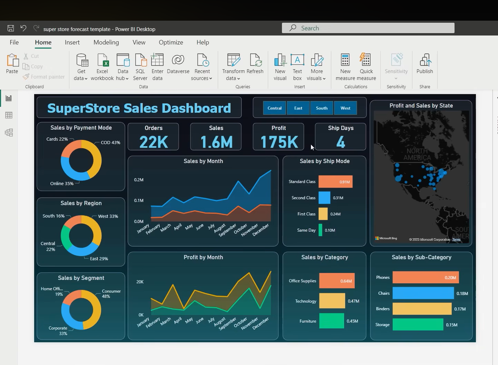

# 📊 SuperStore Sales Dashboard – Data Visualization & Storytelling

## 📌 Project Overview
This project demonstrates how raw sales data can be converted into meaningful insights using Power BI.  
The dashboard provides a clear view of performance, profitability, customer behavior, and regional trends.

## 🎯 Objective
- Create effective visualizations  
- Analyze sales and profit  
- Identify trends and patterns  
- Support business decision-making through data storytelling  

## 🛠 Tools Used
- Power BI  
- Superstore Dataset (Excel)  
- Data Modeling  
- DAX  

## 📈 Key Performance Indicators (KPIs)
- Total Orders: 22K+  
- Total Sales: 1.6M+  
- Total Profit: 175K+  
- Average Shipping Days: ~4  

## 📊 Insights from the Dashboard

### 📅 Monthly Sales Trend
Sales increase toward the last quarter of the year, showing strong seasonal demand and higher customer purchases during that period.

### 💰 Profit Analysis
Although sales are strong, some months have lower profit margins, possibly due to discounts or higher costs.

### 🗂 Category Performance
Office Supplies leads sales, followed by Technology and Furniture.

### 🏆 Top Sub-Categories
Phones, Chairs, and Binders contribute the most revenue.

### 🌍 Regional Performance
West and East regions show higher sales, while Central and South present growth opportunities.

### 👥 Customer Segments
The Consumer segment contributes the majority of sales.

### 🚚 Shipping Preference
Standard Class is the most preferred shipping option, suggesting that customers prioritize cost savings.

### 💳 Payment Mode
Cash on Delivery is the most used payment method, indicating the potential to promote prepaid payment options.

## 📷 Dashboard Preview

## 🧠 Business Recommendations
- Prepare for peak season with inventory and promotions  
- Improve sales strategies in underperforming regions  
- Focus marketing on high-demand categories and sub-categories  
- Encourage prepaid payments with discounts  
- Monitor discount strategies to protect profit margins  

## 🚀 Skills Demonstrated
- Data visualization  
- Dashboard design  
- KPI development  
- Trend analysis  
- Business insight generation  
- Data storytelling
